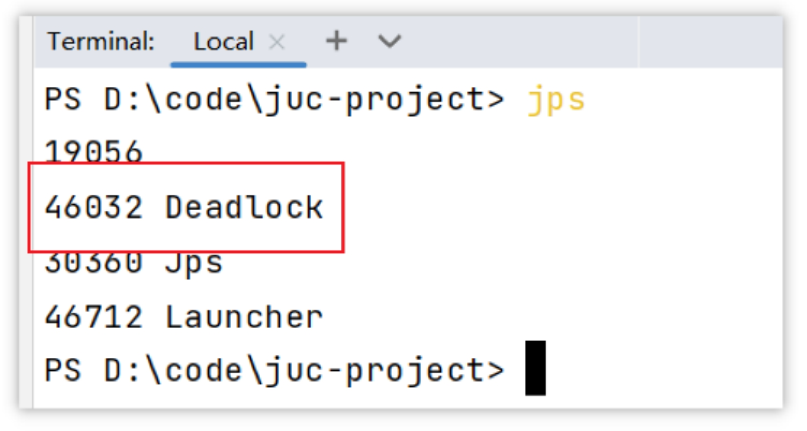
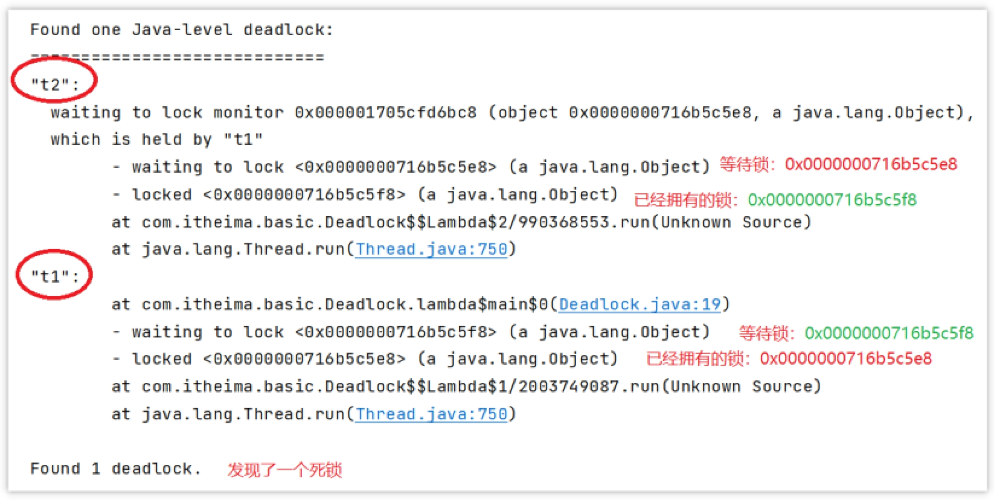

# 12.如何进行死锁诊断？

> 难易程度：☆☆☆
>
> 出现频率：☆☆☆

> [!important]
>
> **参考回答**
>
> 我们只需要通过jdk自动的工具就能搞定我们可以先通过jps来查看当前java程序运行的进程id然后通过jstack来查看这个进程id，就能展示出来死锁的问题，并且，可以定位代码的具体行号范围，我们再去找到对应的代码进行排查就行了。

---

当程序出现了死锁现象，我们可以使用jdk自带的工具：`jps和 jstack`

步骤如下：

第一：查看运行的线程

 

第二：使用jstack查看线程运行的情况，下图是截图的关键信息

运行命令：jstack -l 46032

 

**其他解决工具，可视化工具**

- jconsole

用于对jvm的内存，线程，类 的监控，是一个基于 jmx 的 GUI 性能监控工具

打开方式：java 安装目录 bin目录下 直接启动 jconsole.exe 就行

- VisualVM：故障处理工具

能够监控线程，内存情况，查看方法的CPU时间和内存中的对象，已被GC的对象，反向查看分配的堆栈

打开方式：java 安装目录 bin目录下 直接启动 jvisualvm.exe就行

