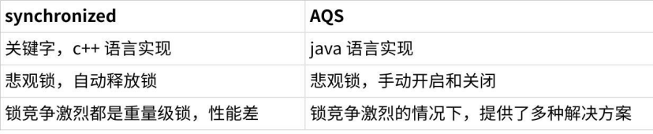
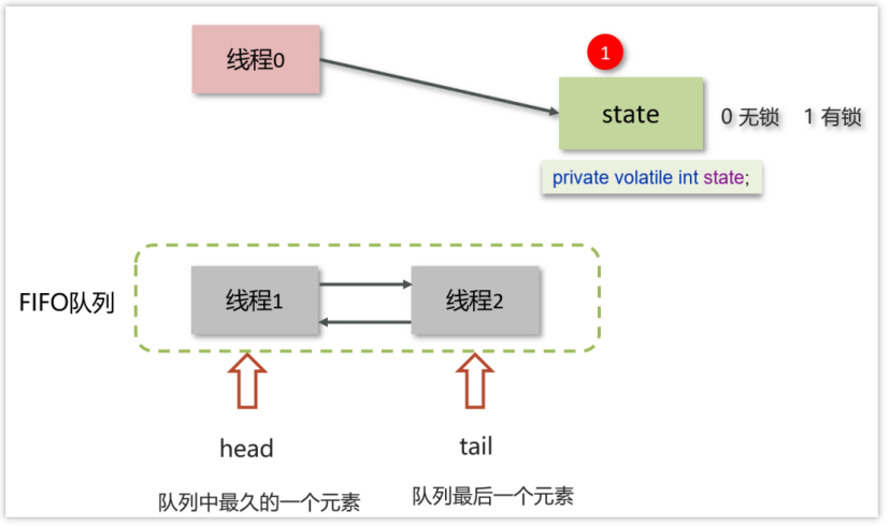
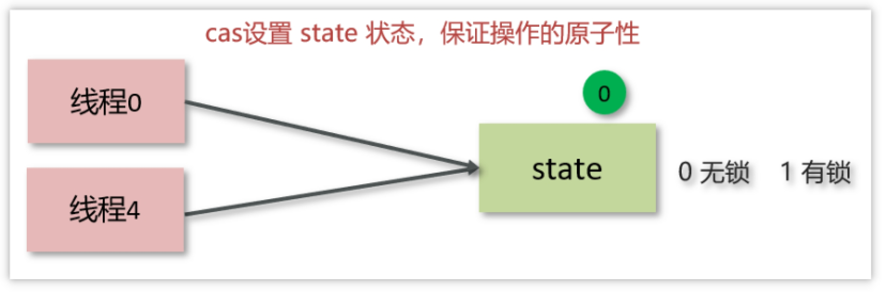

# 6.什么是AQS？

> 难易程度：☆☆☆
>
> 出现频率：☆☆☆

> [!important]
>
> - AQS是多线程中的队列同步器。是一种锁机制，它是做为一个基础框架使用的,像ReentrantLock、Semaphore都是基于AQS实现的
>  - AQS内部维护了一个先进先出的双向队列，队列中存储的排队的线程
>  - 在AQS内部还有一个属性state,这个state就相当于是一个资源，默认是0(无锁状态)，如果队列中的有一个线程修改成功了state为1，则当前线程就相等于获取了资源
>  - 在对state修改的时候使用的cas操作，保证多个线程修改的情况下原子性

---

## 1.**概述**

全称是 AbstractQueuedSynchronizer，是阻塞式锁和相关的同步器工具的框架，它是构建锁或者其他同步组件的基础框架

AQS与Synchronized的区别

**点击图片可查看完整电子表格**

AQS常见的实现类

- ReentrantLock    阻塞式锁

- Semaphore     信号量

- CountDownLatch  倒计时锁

## 2.**工作机制**

- 在AQS中维护了一个使用了volatile修饰的state属性来表示资源的状态，0表示无锁，1表示有锁

- 提供了基于 FIFO 的等待队列，类似于 Monitor 的 EntryList

- 条件变量来实现等待、唤醒机制，支持多个条件变量，类似于 Monitor 的 WaitSet

 

- 线程0来了以后，去尝试修改state属性，如果发现state属性是0，就修改state状态为1，表示线程0抢锁成功•
- 线程1和线程2也会先尝试修改state属性，发现state的值已经是1了，有其他线程持有锁，它们都会到FIFO队列中进行等待
-  FIFO是一个双向队列，head属性表示头结点，tail表示尾结点

**如果多个线程共同去抢这个资源是如何保证原子性的呢？**

 

在去修改state状态的时候，使用的cas自旋锁来保证原子性，确保只能有一个线程修改成功，修改失败的线程将会进入FIFO队列中等待

**AQS是公平锁吗，还是非公平锁？**

- 新的线程与队列中的线程共同来抢资源，是非公平锁

- 新的线程到队列中等待，只让队列中的head线程获取锁，是公平锁

比较典型的AQS实现类ReentrantLock，它默认就是非公平锁，新的线程与队列中的线程共同来抢资源