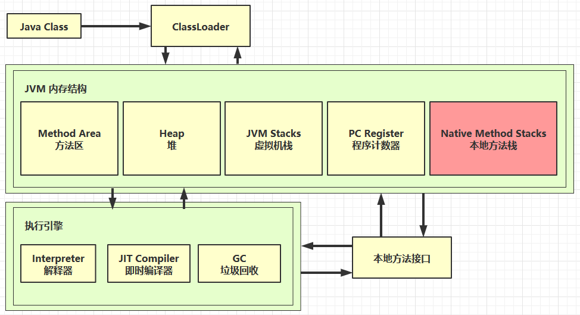

# 3. 本地方法栈

## 3.1 作用

本地方法栈用于执行本地方法（由 C、C++ 等编写），通过 Java Native Interface（JNI）与 Java 程序交互，主要用于与底层系统进行交互。

## 3.2 与 Java 虚拟机栈的区别

- 虚拟机栈用于执行 Java 方法，而本地方法栈用于执行本地方法。

## 3.3 栈帧结构

- 本地方法栈的栈帧结构与虚拟机栈类似，但栈帧中包含本地方法的特定信息，如参数和返回值。

## 3.4 栈大小限制

- 本地方法栈通常较小，因为本地方法的调用相对简单。

## 3.5 安全性考虑

- 本地方法栈的安全性需要开发人员注意，因本地方法由本地代码编写，JVM 无法直接控制。