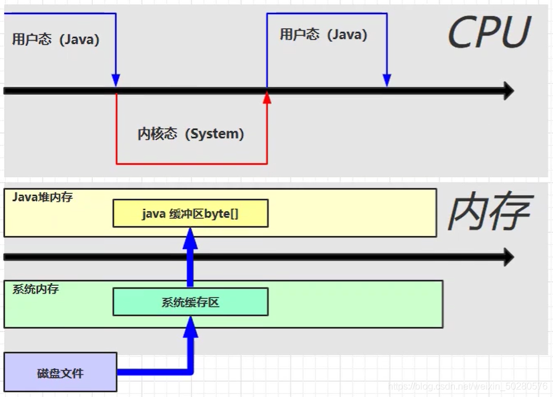
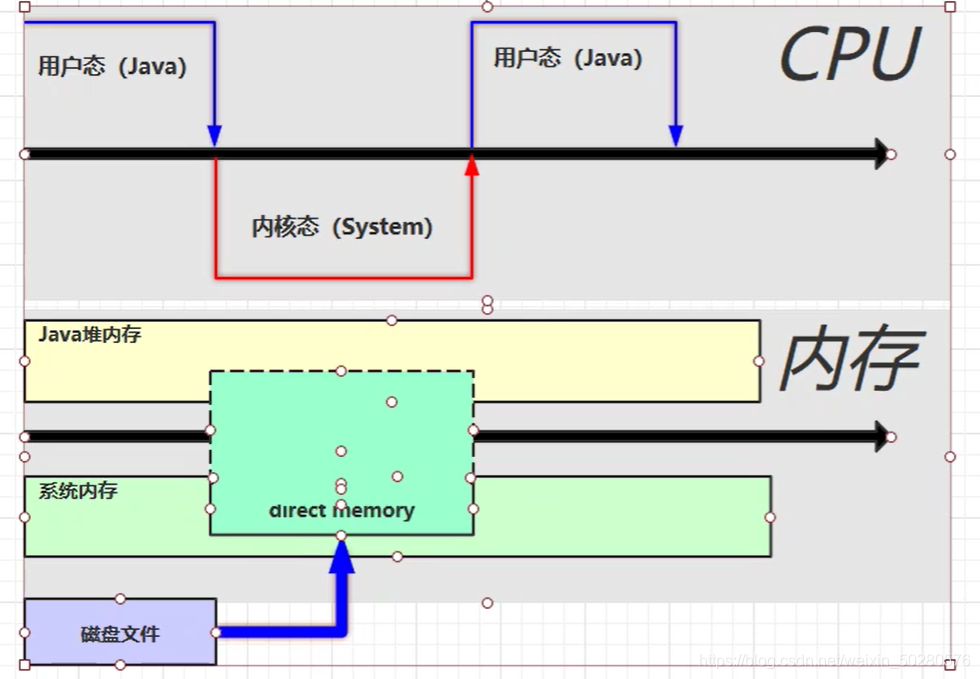

# 6.直接内存

## 6.1 什么是直接内存？

### 6.1.1 直接内存的定义

> 直接内存（Direct Memory）是一种特殊的内存区域，常见于 Java NIO（New Input/Output）操作中，用作数据缓冲区。





### 6.1.2 直接内存的特点

- 性能优势：直接内存不需要在 Java 堆和操作系统内存之间频繁复制数据，读写性能高。

- 管理方式：直接内存由操作系统分配和回收，不受 JVM 垃圾回收（GC）管理。

- 使用代价：分配和回收的成本较高，需要谨慎管理，否则容易导致内存泄漏。

## 6.2 为什么要使用直接内存？

### 6.2.1 文件读写的常规流程

在 Java 中，文件读取通常涉及以下步骤：

1. 使用本地方法切换到内核态，通过系统调用读取磁盘文件。

2. 将数据存储到系统缓冲区。

3. 将系统缓冲区中的数据复制到 Java 堆内存中。

**缺点**：

这种方法会在系统缓冲区和 Java 堆内存中各存储一份数据，增加了不必要的内存复制操作，降低性能。

### 6.2.2 使用直接内存的改进

通过 DirectBuffer 使用直接内存后，操作系统和 Java 程序共享直接内存区域，避免了从系统缓冲区到 Java 堆的复制步骤，从而显著提升读写效率。

## 6.3 直接内存的回收机制


### 6.3.1 基于 Unsafe 的内存分配和释放


以下是直接内存分配和释放的核心代码：

```java
long size = Math.max(1L, (long) capacity);

long base = unsafe.allocateMemory(size); // 分配内存

unsafe.setMemory(base, size, (byte) 0); // 初始化内存
```

### 6.3.2 ByteBuffer 的实现

直接内存的分配可以通过 ByteBuffer.allocateDirect 方法实现：

```java
public static ByteBuffer allocateDirect(int capacity) {

  return new DirectByteBuffer(capacity);

}

```

#### 6.3.2.1 DirectByteBuffer 的构造过程

以下是 DirectByteBuffer 的核心构造代码：

```java


DirectByteBuffer(int cap) {

  super(-1, 0, cap, cap);

  long size = Math.max(1L, (long) cap);

  long base = unsafe.allocateMemory(size); // 分配内存

  unsafe.setMemory(base, size, (byte) 0); // 初始化

  cleaner = Cleaner.create(this, new Deallocator(base, size, cap)); // 注册虚引用

}
```

### 6.3.3 Cleaner 的作用

Cleaner 是基于虚引用的工具，用于监测 DirectByteBuffer 对象。当对象被 GC 回收时，会调用 Cleaner 的 clean 方法释放内存：

```java
public void clean() {

  if (remove(this)) {

			this.thunk.run(); // 调用 Deallocator 的 run 方法

  }

}
```

6.3.3.1 Deallocator 的 run 方法

Deallocator 的 run 方法核心逻辑如下：

```java
public void run() {

  unsafe.freeMemory(address); // 释放直接内存

  address = 0;

}
```

### 6.3.4 显式调用 GC 的限制


通过 System.gc() 可以手动触发垃圾回收，但在配置了 -XX:+DisableExplicitGC 时，该方法会失效。这种配置在生产环境中常用，以避免显式 GC 引起的长时间停顿。


## 6.4 直接内存的管理注意事项


### 6.4.1 内存泄漏风险

直接内存不受 JVM 自动管理。分配后需要显式释放，或者通过 Cleaner 间接回收，否则容易造成内存泄漏。

### 6.4.2 内存大小限制

直接内存的大小由 -XX:MaxDirectMemorySize 参数限制。若未指定，默认值与堆内存大小相等。

### 6.4.3 调优建议

- 使用 -XX:+DisableExplicitGC 禁止手动调用 GC，减少性能抖动。

- 定期检查直接内存使用情况，避免超出限制引发 OutOfMemoryError。

## 6.5 总结

### 6.5.1 优点

- 减少内存复制步骤，提升 I/O 性能。

- 适合处理大文件或高频数据传输场景。

### 6.5.2 缺点

- 分配和释放成本较高。
- 不受 GC 管理，使用不当可能导致内存泄漏。

### 6.5.3 关键机制

通过 Unsafe 和 Cleaner 实现分配和回收，程序需额外关注内存使用和释放逻辑。