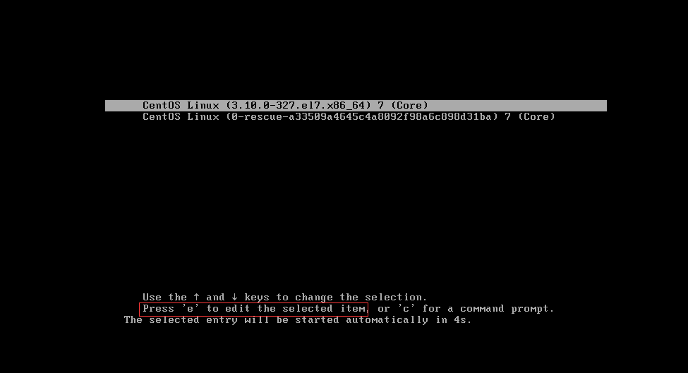
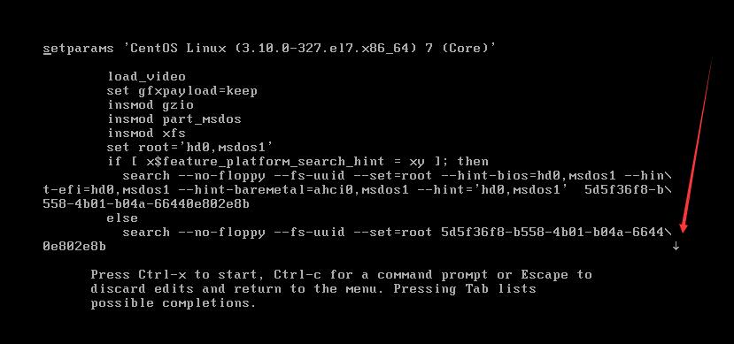
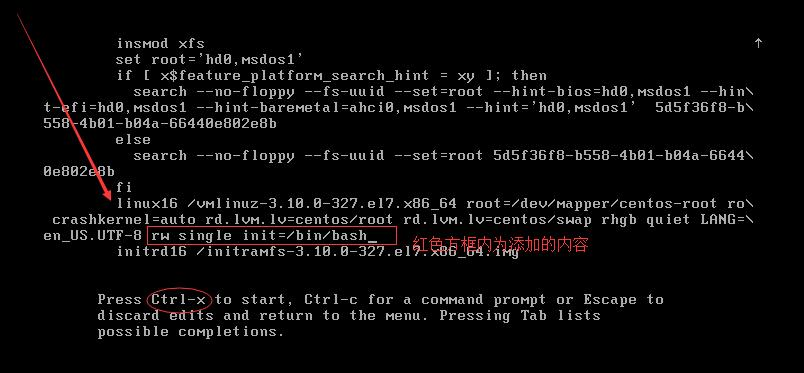
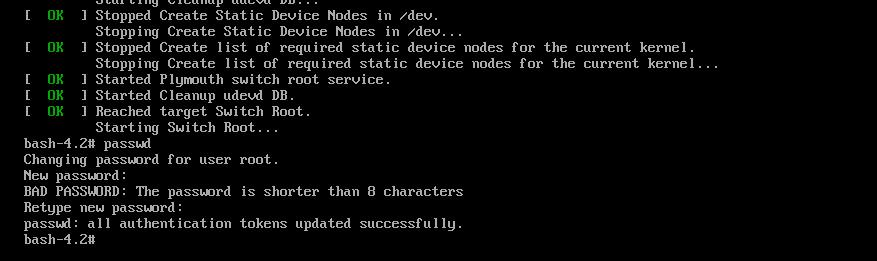
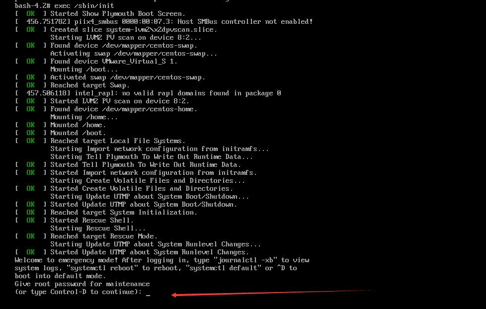

# 单用户模式重置root密码

启动Linux Centos7系统，当出现如下画面时，直接按“e”键继续。

### 

 

###  2、看到如下界面后，往下拉

:warning:注意:arrow_down:拉一下，否则看不到那行

### 

### 3、在如下截图的位置，添加“rw single init=/bin/bash”，添加后按“Ctrl + x”引导系统。 

### 

 

###  4、输入“passwd”重置root密码

### 

 

### 5、运行命令“exec /sbin/init”来正常启动系统，需要输入修改后的root密码。

###  

###  6、进入系统后，输入命令“reboot”重启系统。

注意：如果不重启，有些命令运行会出错