# 微服务保护


# 1.初识Sentinel


## 1.1.雪崩问题及解决方案


### 1.1.1.雪崩问题


微服务中，服务间调用关系错综复杂，一个微服务往往依赖于多个其它微服务。

 


如图，如果服务提供者I发生了故障，当前的应用的部分业务因为依赖于服务I，因此也会被阻塞。此时，其它不依赖于服务I的业务似乎不受影响。
<!-- more -->
 

但是，依赖服务I的业务请求被阻塞，用户不会得到响应，则tomcat的这个线程不会释放，于是越来越多的用户请求到来，越来越多的线程会阻塞：

 

服务器支持的线程和并发数有限，请求一直阻塞，会导致服务器资源耗尽，从而导致所有其它服务都不可用，那么当前服务也就不可用了。

那么，依赖于当前服务的其它服务随着时间的推移，最终也都会变的不可用，形成级联失败，雪崩就发生了：


### 1.1.2.超时处理

解决雪崩问题的常见方式有四种：

•超时处理：设定超时时间，请求超过一定时间没有响应就返回错误信息，不会无休止等待


### 1.1.3.仓壁模式

方案2：仓壁模式

仓壁模式来源于船舱的设计：


船舱都会被隔板分离为多个独立空间，当船体破损时，只会导致部分空间进入，将故障控制在一定范围内，避免整个船体都被淹没。


于此类似，我们可以限定每个业务能使用的线程数，避免耗尽整个tomcat的资源，因此也叫线程隔离。


### 1.1.4.断路器

断路器模式：由**断路器**统计业务执行的异常比例，如果超出阈值则会**熔断**该业务，拦截访问该业务的一切请求。

断路器会统计访问某个服务的请求数量，异常比例：


当发现访问服务D的请求异常比例过高时，认为服务D有导致雪崩的风险，会拦截访问服务D的一切请求，形成熔断：


### 1.1.5.限流

**流量控制**：限制业务访问的QPS，避免服务因流量的突增而故障。


### 1.1.6.总结

什么是雪崩问题？

- 微服务之间相互调用，因为调用链中的一个服务故障，引起整个链路都无法访问的情况。


可以认为：

**限流**是对服务的保护，避免因瞬间高并发流量而导致服务故障，进而避免雪崩。是一种**预防**措施。

**超时处理、线程隔离、降级熔断**是在部分服务故障时，将故障控制在一定范围，避免雪崩。是一种**补救**措施。


## 1.2.服务保护技术对比

在SpringCloud当中支持多种服务保护技术：

- [Netfix Hystrix](https://github.com/Netflix/Hystrix)
- [Sentinel](https://github.com/alibaba/Sentinel)
- [Resilience4J](https://github.com/resilience4j/resilience4j)

早期比较流行的是Hystrix框架，但目前国内实用最广泛的还是阿里巴巴的Sentinel框架，这里我们做下对比：

|                | **Sentinel**                                   | **Hystrix**                   |
| -------------- | ---------------------------------------------- | ----------------------------- |
| 隔离策略       | 信号量隔离                                     | 线程池隔离/信号量隔离         |
| 熔断降级策略   | 基于慢调用比例或异常比例                       | 基于失败比率                  |
| 实时指标实现   | 滑动窗口                                       | 滑动窗口（基于 RxJava）       |
| 规则配置       | 支持多种数据源                                 | 支持多种数据源                |
| 扩展性         | 多个扩展点                                     | 插件的形式                    |
| 基于注解的支持 | 支持                                           | 支持                          |
| 限流           | 基于 QPS，支持基于调用关系的限流               | 有限的支持                    |
| 流量整形       | 支持慢启动、匀速排队模式                       | 不支持                        |
| 系统自适应保护 | 支持                                           | 不支持                        |
| 控制台         | 开箱即用，可配置规则、查看秒级监控、机器发现等 | 不完善                        |
| 常见框架的适配 | Servlet、Spring Cloud、Dubbo、gRPC  等         | Servlet、Spring Cloud Netflix |


## 1.3.Sentinel介绍和安装


### 1.3.1.初识Sentinel

Sentinel是阿里巴巴开源的一款微服务流量控制组件。官网地址：https://sentinelguard.io/zh-cn/index.html

Sentinel 具有以下特征:

•**丰富的应用场景**：Sentinel 承接了阿里巴巴近 10 年的双十一大促流量的核心场景，例如秒杀（即突发流量控制在系统容量可以承受的范围）、消息削峰填谷、集群流量控制、实时熔断下游不可用应用等。

•**完备的实时监控**：Sentinel 同时提供实时的监控功能。您可以在控制台中看到接入应用的单台机器秒级数据，甚至 500 台以下规模的集群的汇总运行情况。

•**广泛的开源生态**：Sentinel 提供开箱即用的与其它开源框架/库的整合模块，例如与 Spring Cloud、Dubbo、gRPC 的整合。您只需要引入相应的依赖并进行简单的配置即可快速地接入 Sentinel。

•**完善的** **SPI** **扩展点**：Sentinel 提供简单易用、完善的 SPI 扩展接口。您可以通过实现扩展接口来快速地定制逻辑。例如定制规则管理、适配动态数据源等。


### 1.3.2.安装Sentinel

1）下载

sentinel官方提供了UI控制台，方便我们对系统做限流设置。大家可以在[GitHub](https://github.com/alibaba/Sentinel/releases)下载。

课前资料也提供了下载好的jar包：


2）运行

将jar包放到任意非中文目录，执行命令：

```sh
java -jar sentinel-dashboard-1.8.1.jar
```

如果要修改Sentinel的默认端口、账户、密码，可以通过下列配置：

| **配置项**                       | **默认值** | **说明**   |
| -------------------------------- | ---------- | ---------- |
| server.port                      | 8080       | 服务端口   |
| sentinel.dashboard.auth.username | sentinel   | 默认用户名 |
| sentinel.dashboard.auth.password | sentinel   | 默认密码   |

例如，修改端口：

```sh
java -Dserver.port=8090 -jar sentinel-dashboard-1.8.1.jar
```


3）访问

访问http://localhost:8080页面，就可以看到sentinel的控制台了：


需要输入账号和密码，默认都是：sentinel


登录后，发现一片空白，什么都没有：


这是因为我们还没有与微服务整合。


## 1.4.微服务整合Sentinel

我们在order-service中整合sentinel，并连接sentinel的控制台，步骤如下：

1）引入sentinel依赖

```xml
<!--sentinel-->
<dependency>
    <groupId>com.alibaba.cloud</groupId> 
    <artifactId>spring-cloud-starter-alibaba-sentinel</artifactId>
</dependency>
```


2）配置控制台

修改application.yaml文件，添加下面内容：

```yaml
server:
  port: 8088
spring:
  cloud: 
    sentinel:
      transport:
        dashboard: localhost:8080
```


3）访问order-service的任意端点

打开浏览器，访问http://localhost:8088/order/101，这样才能触发sentinel的监控。

然后再访问sentinel的控制台，查看效果：


# 2.流量控制

雪崩问题虽然有四种方案，但是限流是避免服务因突发的流量而发生故障，是对微服务雪崩问题的预防。我们先学习这种模式。

## 2.1.簇点链路

当请求进入微服务时，首先会访问DispatcherServlet，然后进入Controller、Service、Mapper，这样的一个调用链就叫做**簇点链路**。簇点链路中被监控的每一个接口就是一个**资源**。

默认情况下sentinel会监控SpringMVC的每一个端点（Endpoint，也就是controller中的方法），因此SpringMVC的每一个端点（Endpoint）就是调用链路中的一个资源。


例如，我们刚才访问的order-service中的OrderController中的端点：/order/{orderId}


流控、熔断等都是针对簇点链路中的资源来设置的，因此我们可以点击对应资源后面的按钮来设置规则：

- 流控：流量控制
- 降级：降级熔断
- 热点：热点参数限流，是限流的一种
- 授权：请求的权限控制


## 2.1.快速入门


### 2.1.1.示例

点击资源/order/{orderId}后面的流控按钮，就可以弹出表单。


表单中可以填写限流规则，如下：

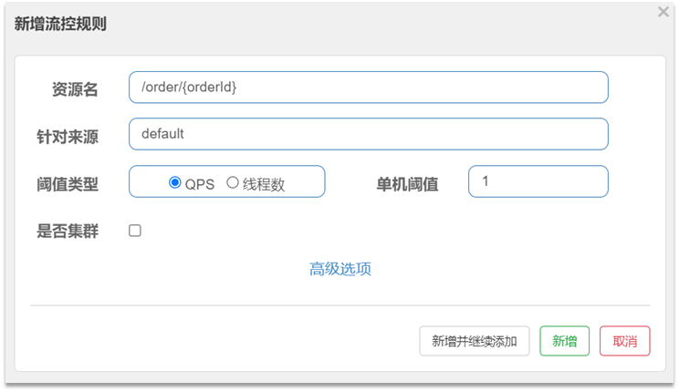

其含义是限制 /order/{orderId}这个资源的单机QPS为1，即每秒只允许1次请求，超出的请求会被拦截并报错。


### 2.1.2.练习：

需求：给 /order/{orderId}这个资源设置流控规则，QPS不能超过 5，然后测试。


1）首先在sentinel控制台添加限流规则


2）利用jmeter测试

如果没有用过jmeter，可以参考课前资料提供的文档《Jmeter快速入门.md》

课前资料提供了编写好的Jmeter测试样例：


打开jmeter，导入课前资料提供的测试样例：

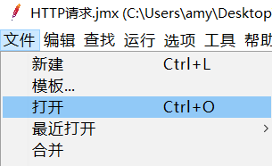

选择：

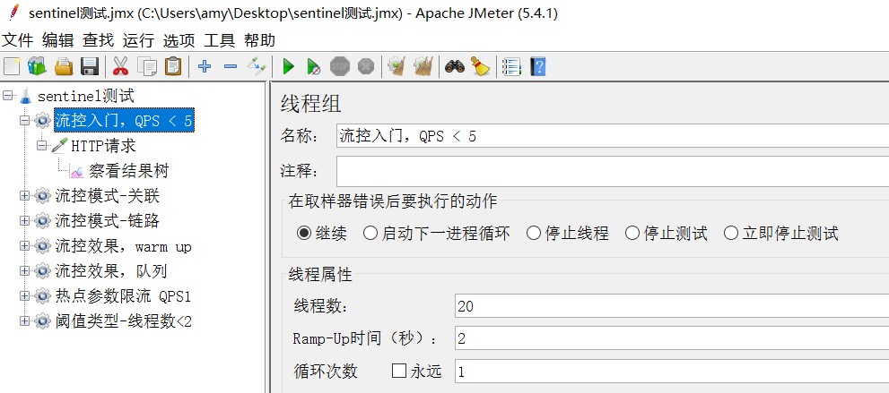

20个用户，2秒内运行完，QPS是10，超过了5.

选中`流控入门，QPS<5`右键运行：


> 注意，不要点击菜单中的执行按钮来运行。


结果：


可以看到，成功的请求每次只有5个


## 2.2.流控模式

在添加限流规则时，点击高级选项，可以选择三种**流控模式**：

- 直接：统计当前资源的请求，触发阈值时对当前资源直接限流，也是默认的模式
- 关联：统计与当前资源相关的另一个资源，触发阈值时，对当前资源限流
- 链路：统计从指定链路访问到本资源的请求，触发阈值时，对指定链路限流

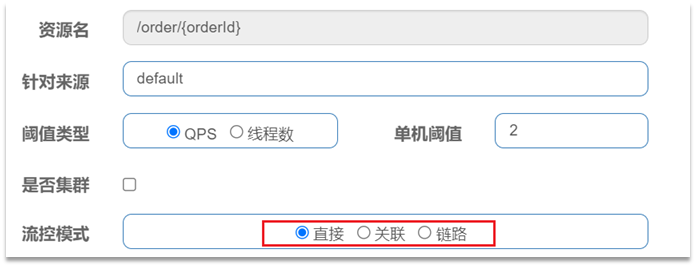


快速入门测试的就是直接模式。


### 2.2.1.关联模式

**关联模式**：统计与当前资源相关的另一个资源，触发阈值时，对当前资源限流

**配置规则**：

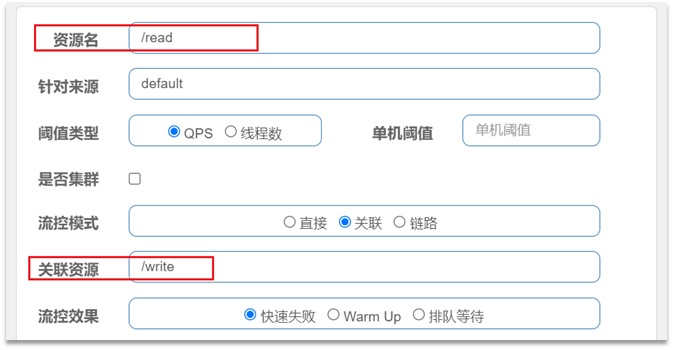

**语法说明**：当/write资源访问量触发阈值时，就会对/read资源限流，避免影响/write资源。


**使用场景**：比如用户支付时需要修改订单状态，同时用户要查询订单。查询和修改操作会争抢数据库锁，产生竞争。业务需求是优先支付和更新订单的业务，因此当修改订单业务触发阈值时，需要对查询订单业务限流。


**需求说明**：

- 在OrderController新建两个端点：/order/query和/order/update，无需实现业务

- 配置流控规则，当/order/ update资源被访问的QPS超过5时，对/order/query请求限流


1）定义/order/query端点，模拟订单查询

```java
@GetMapping("/query")
public String queryOrder() {
    return "查询订单成功";
}
```

2）定义/order/update端点，模拟订单更新

```java
@GetMapping("/update")
public String updateOrder() {
    return "更新订单成功";
}
```

重启服务，查看sentinel控制台的簇点链路：


3）配置流控规则

对哪个端点限流，就点击哪个端点后面的按钮。我们是对订单查询/order/query限流，因此点击它后面的按钮：


在表单中填写流控规则：


4）在Jmeter测试

选择《流控模式-关联》：


可以看到1000个用户，100秒，因此QPS为10，超过了我们设定的阈值：5

查看http请求：


请求的目标是/order/update，这样这个断点就会触发阈值。

但限流的目标是/order/query，我们在浏览器访问，可以发现：


确实被限流了。


5）总结


### 2.2.2.链路模式

**链路模式**：只针对从指定链路访问到本资源的请求做统计，判断是否超过阈值。

**配置示例**：

例如有两条请求链路：

- /test1 --> /common

- /test2 --> /common

如果只希望统计从/test2进入到/common的请求，则可以这样配置：


**实战案例**

需求：有查询订单和创建订单业务，两者都需要查询商品。针对从查询订单进入到查询商品的请求统计，并设置限流。

步骤：

1. 在OrderService中添加一个queryGoods方法，不用实现业务

2. 在OrderController中，改造/order/query端点，调用OrderService中的queryGoods方法

3. 在OrderController中添加一个/order/save的端点，调用OrderService的queryGoods方法

4. 给queryGoods设置限流规则，从/order/query进入queryGoods的方法限制QPS必须小于2


实现：

#### 1）添加查询商品方法

在order-service服务中，给OrderService类添加一个queryGoods方法：

```java
public void queryGoods(){
    System.err.println("查询商品");
}
```


#### 2）查询订单时，查询商品

在order-service的OrderController中，修改/order/query端点的业务逻辑：

```java
@GetMapping("/query")
public String queryOrder() {
    // 查询商品
    orderService.queryGoods();
    // 查询订单
    System.out.println("查询订单");
    return "查询订单成功";
}
```


#### 3）新增订单，查询商品

在order-service的OrderController中，修改/order/save端点，模拟新增订单：

```java
@GetMapping("/save")
public String saveOrder() {
    // 查询商品
    orderService.queryGoods();
    // 查询订单
    System.err.println("新增订单");
    return "新增订单成功";
}
```


#### 4）给查询商品添加资源标记

默认情况下，OrderService中的方法是不被Sentinel监控的，需要我们自己通过注解来标记要监控的方法。

给OrderService的queryGoods方法添加@SentinelResource注解：

```java
@SentinelResource("goods")
public void queryGoods(){
    System.err.println("查询商品");
}
```


链路模式中，是对不同来源的两个链路做监控。但是sentinel默认会给进入SpringMVC的所有请求设置同一个root资源，会导致链路模式失效。

我们需要关闭这种对SpringMVC的资源聚合，修改order-service服务的application.yml文件：

```yaml
spring:
  cloud:
    sentinel:
      web-context-unify: false # 关闭context整合
```

重启服务，访问/order/query和/order/save，可以查看到sentinel的簇点链路规则中，出现了新的资源：


#### 5）添加流控规则

点击goods资源后面的流控按钮，在弹出的表单中填写下面信息：


只统计从/order/query进入/goods的资源，QPS阈值为2，超出则被限流。


#### 6）Jmeter测试

选择《流控模式-链路》：


可以看到这里200个用户，50秒内发完，QPS为4，超过了我们设定的阈值2

一个http请求是访问/order/save：


运行的结果：


完全不受影响。


另一个是访问/order/query：


运行结果：


每次只有2个通过。


### 2.2.3.总结

流控模式有哪些？

•直接：对当前资源限流

•关联：高优先级资源触发阈值，对低优先级资源限流。

•链路：阈值统计时，只统计从指定资源进入当前资源的请求，是对请求来源的限流


## 2.3.流控效果

在流控的高级选项中，还有一个流控效果选项：


流控效果是指请求达到流控阈值时应该采取的措施，包括三种：

- 快速失败：达到阈值后，新的请求会被立即拒绝并抛出FlowException异常。是默认的处理方式。

- warm up：预热模式，对超出阈值的请求同样是拒绝并抛出异常。但这种模式阈值会动态变化，从一个较小值逐渐增加到最大阈值(慢开始)。

- 排队等待：让所有的请求按照先后次序排队执行，两个请求的间隔不能小于指定时长


### 2.3.1.warm up

阈值一般是一个微服务能承担的最大QPS，但是一个服务刚刚启动时，一切资源尚未初始化（**冷启动**），如果直接将QPS跑到最大值，可能导致服务瞬间宕机。


warm up也叫**预热模式**，是应对服务冷启动的一种方案。请求阈值初始值是 maxThreshold / coldFactor，持续指定时长后，逐渐提高到maxThreshold值。而coldFactor的默认值是3.

例如，我设置QPS的maxThreshold为10，预热时间为5秒，那么初始阈值就是 10 / 3 ，也就是3，然后在5秒后逐渐增长到10.


**案例**

需求：给/order/{orderId}这个资源设置限流，最大QPS为10，利用warm up效果，预热时长为5秒


#### 1）配置流控规则：


#### 2）Jmeter测试

选择《流控效果，warm up》：


QPS为10.

刚刚启动时，大部分请求失败，成功的只有3个，说明QPS被限定在3：


随着时间推移，成功比例越来越高：

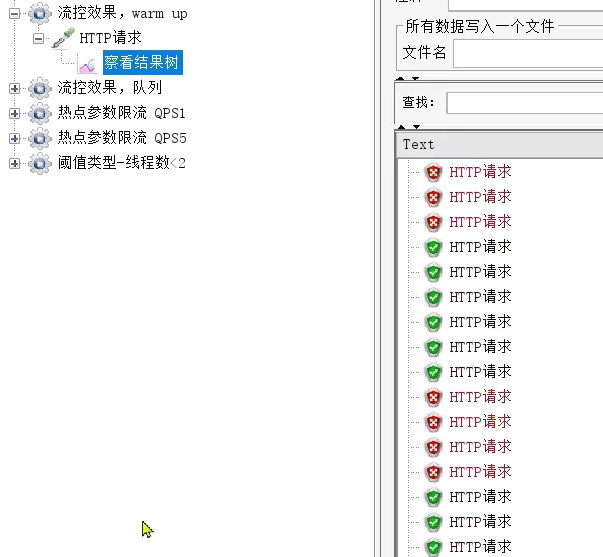


到Sentinel控制台查看实时监控：


一段时间后：


### 2.3.2.排队等待

当请求超过QPS阈值时，快速失败和warm up 会拒绝新的请求并抛出异常。

而排队等待则是让所有请求进入一个队列中，然后按照阈值允许的时间间隔依次执行。后来的请求必须等待前面执行完成，如果请求预期的等待时间超出最大时长，则会被拒绝。

工作原理

例如：QPS = 5，意味着每200ms处理一个队列中的请求；timeout = 2000，意味着**预期等待时长**超过2000ms的请求会被拒绝并抛出异常。

那什么叫做预期等待时长呢？

比如现在一下子来了12 个请求，因为每200ms执行一个请求，那么：

- 第6个请求的**预期等待时长** =  200 * （6 - 1） = 1000ms
- 第12个请求的预期等待时长 = 200 * （12-1） = 2200ms


现在，第1秒同时接收到10个请求，但第2秒只有1个请求，此时QPS的曲线这样的：


如果使用队列模式做流控，所有进入的请求都要排队，以固定的200ms的间隔执行，QPS会变的很平滑：


平滑的QPS曲线，对于服务器来说是更友好的。


**案例**

需求：给/order/{orderId}这个资源设置限流，最大QPS为10，利用排队的流控效果，超时时长设置为5s


#### 1）添加流控规则


#### 2）Jmeter测试

选择《流控效果，队列》：


QPS为15，已经超过了我们设定的10。

如果是之前的 快速失败、warmup模式，超出的请求应该会直接报错。

但是我们看看队列模式的运行结果：


全部都通过了。

再去sentinel查看实时监控的QPS曲线：


QPS非常平滑，一致保持在10，但是超出的请求没有被拒绝，而是放入队列。因此**响应时间**（等待时间）会越来越长。

当队列满了以后，才会有部分请求失败：


### 2.3.3.总结

流控效果有哪些？

- 快速失败：QPS超过阈值时，拒绝新的请求

- warm up： QPS超过阈值时，拒绝新的请求；QPS阈值是逐渐提升的，可以避免冷启动时高并发导致服务宕机。

- 排队等待：请求会进入队列，按照阈值允许的时间间隔依次执行请求；如果请求预期等待时长大于超时时间，直接拒绝


## 2.4.热点参数限流

之前的限流是统计访问某个资源的所有请求，判断是否超过QPS阈值。而热点参数限流是**分别统计参数值相同的请求**，判断是否超过QPS阈值。

### 2.4.1.全局参数限流

例如，一个根据id查询商品的接口：


访问/goods/{id}的请求中，id参数值会有变化，热点参数限流会根据参数值分别统计QPS，统计结果：


当id=1的请求触发阈值被限流时，id值不为1的请求不受影响。


配置示例：


代表的含义是：对hot这个资源的0号参数（第一个参数）做统计，每1秒**相同参数值**的请求数不能超过5


### 2.4.2.热点参数限流

刚才的配置中，对查询商品这个接口的所有商品一视同仁，QPS都限定为5.

而在实际开发中，可能部分商品是热点商品，例如秒杀商品，我们希望这部分商品的QPS限制与其它商品不一样，高一些。那就需要配置热点参数限流的高级选项了：


结合上一个配置，这里的含义是对0号的long类型参数限流，每1秒相同参数的QPS不能超过5，有两个例外：

•如果参数值是100，则每1秒允许的QPS为10

•如果参数值是101，则每1秒允许的QPS为15


### 2.4.4.案例

**案例需求**：给/order/{orderId}这个资源添加热点参数限流，规则如下：

•默认的热点参数规则是每1秒请求量不超过2

•给102这个参数设置例外：每1秒请求量不超过4

•给103这个参数设置例外：每1秒请求量不超过10


**注意事项**：热点参数限流对默认的SpringMVC资源无效，需要利用@SentinelResource注解标记资源


#### 1）标记资源

给order-service中的OrderController中的/order/{orderId}资源添加注解：

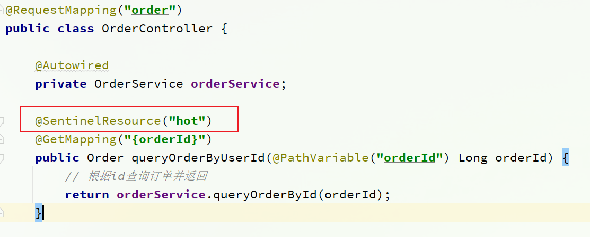


#### 2）热点参数限流规则

访问该接口，可以看到我们标记的hot资源出现了：


这里不要点击hot后面的按钮，页面有BUG


点击左侧菜单中**热点规则**菜单：


点击新增，填写表单：


#### 3）Jmeter测试

选择《热点参数限流 QPS1》：


这里发起请求的QPS为5.

包含3个http请求：

普通参数，QPS阈值为2


运行结果：


例外项，QPS阈值为4


运行结果：


例外项，QPS阈值为10


运行结果：


# 3.隔离和降级

限流是一种预防措施，虽然限流可以尽量避免因高并发而引起的服务故障，但服务还会因为其它原因而故障。

而要将这些故障控制在一定范围，避免雪崩，就要靠**线程隔离**（舱壁模式）和**熔断降级**手段了。


**线程隔离**之前讲到过：调用者在调用服务提供者时，给每个调用的请求分配独立线程池，出现故障时，最多消耗这个线程池内资源，避免把调用者的所有资源耗尽。


**熔断降级**：是在调用方这边加入断路器，统计对服务提供者的调用，如果调用的失败比例过高，则熔断该业务，不允许访问该服务的提供者了。


可以看到，不管是线程隔离还是熔断降级，都是对**客户端**（调用方）的保护。需要在**调用方** 发起远程调用时做线程隔离、或者服务熔断。

而我们的微服务远程调用都是基于Feign来完成的，因此我们需要将Feign与Sentinel整合，在Feign里面实现线程隔离和服务熔断。


## 3.1.FeignClient整合Sentinel

SpringCloud中，微服务调用都是通过Feign来实现的，因此做客户端保护必须整合Feign和Sentinel。


### 3.1.1.修改配置，开启sentinel功能

修改OrderService的application.yml文件，开启Feign的Sentinel功能：

```yaml
feign:
  sentinel:
    enabled: true # 开启feign对sentinel的支持
```


### 3.1.2.编写失败降级逻辑

业务失败后，不能直接报错，而应该返回用户一个友好提示或者默认结果，这个就是失败降级逻辑。

给FeignClient编写失败后的降级逻辑

①方式一：FallbackClass，无法对远程调用的异常做处理

②方式二：FallbackFactory，可以对远程调用的异常做处理，我们选择这种


这里我们演示方式二的失败降级处理。

**步骤一**：在feing-api项目中定义类，实现FallbackFactory：


代码：

```java
package cn.itcast.feign.clients.fallback;

import cn.itcast.feign.clients.UserClient;
import cn.itcast.feign.pojo.User;
import feign.hystrix.FallbackFactory;
import lombok.extern.slf4j.Slf4j;

@Slf4j
public class UserClientFallbackFactory implements FallbackFactory<UserClient> {
    @Override
    public UserClient create(Throwable throwable) {
        return new UserClient() {
            @Override
            public User findById(Long id) {
                log.error("查询用户异常", throwable);
                return new User();
            }
        };
    }
}

```


**步骤二**：在feing-api项目中的DefaultFeignConfiguration类中将UserClientFallbackFactory注册为一个Bean：

```java
@Bean
public UserClientFallbackFactory userClientFallbackFactory(){
    return new UserClientFallbackFactory();
}
```

**步骤三**：在feing-api项目中的UserClient接口中使用UserClientFallbackFactory：

```java
import cn.itcast.feign.clients.fallback.UserClientFallbackFactory;
import cn.itcast.feign.pojo.User;
import org.springframework.cloud.openfeign.FeignClient;
import org.springframework.web.bind.annotation.GetMapping;
import org.springframework.web.bind.annotation.PathVariable;

@FeignClient(value = "userservice", fallbackFactory = UserClientFallbackFactory.class)
public interface UserClient {

    @GetMapping("/user/{id}")
    User findById(@PathVariable("id") Long id);
}
```


重启后，访问一次订单查询业务，然后查看sentinel控制台，可以看到新的簇点链路：


### 3.1.3.总结

Sentinel支持的雪崩解决方案：

- 线程隔离（仓壁模式）
- 降级熔断

Feign整合Sentinel的步骤：

- 在application.yml中配置：feign.sentienl.enable=true
- 给FeignClient编写FallbackFactory并注册为Bean
- 将FallbackFactory配置到FeignClient


## 3.2.线程隔离（舱壁模式）


### 3.2.1.线程隔离的实现方式

线程隔离有两种方式实现：

- 线程池隔离

- 信号量隔离（Sentinel默认采用）

如图：


**线程池隔离**：给每个服务调用业务分配一个线程池，利用线程池本身实现隔离效果

**信号量隔离**：不创建线程池，而是计数器模式，记录业务使用的线程数量，达到信号量上限时，禁止新的请求。


两者的优缺点：

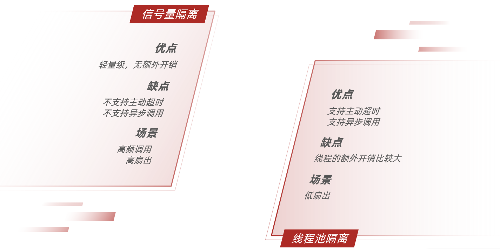


### 3.2.2.sentinel的线程隔离

**用法说明**：

在添加限流规则时，可以选择两种阈值类型：


- QPS：就是每秒的请求数，在快速入门中已经演示过

- 线程数：是该资源能使用用的tomcat线程数的最大值。也就是通过限制线程数量，实现**线程隔离**（舱壁模式）。


**案例需求**：给 order-service服务中的UserClient的查询用户接口设置流控规则，线程数不能超过 2。然后利用jemeter测试。


#### 1）配置隔离规则

选择feign接口后面的流控按钮：


填写表单：


#### 2）Jmeter测试

选择《阈值类型-线程数<2》：


一次发生10个请求，有较大概率并发线程数超过2，而超出的请求会走之前定义的失败降级逻辑。


查看运行结果：


发现虽然结果都是通过了，不过部分请求得到的响应是降级返回的null信息。


### 3.2.3.总结

线程隔离的两种手段是？

- 信号量隔离

- 线程池隔离

信号量隔离的特点是？

- 基于计数器模式，简单，开销小

线程池隔离的特点是？

- 基于线程池模式，有额外开销，但隔离控制更强


## 3.3.熔断降级

熔断降级是解决雪崩问题的重要手段。其思路是由**断路器**统计服务调用的异常比例、慢请求比例，如果超出阈值则会**熔断**该服务。即拦截访问该服务的一切请求；而当服务恢复时，断路器会放行访问该服务的请求。

断路器控制熔断和放行是通过状态机来完成的：

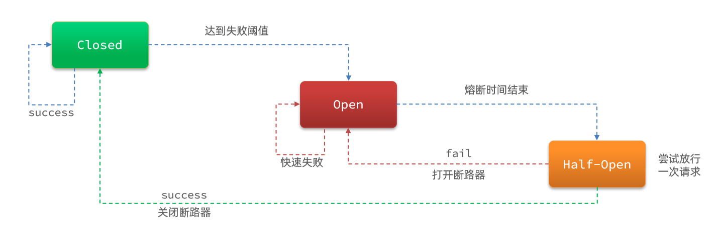

状态机包括三个状态：

- closed：关闭状态，断路器放行所有请求，并开始统计异常比例、慢请求比例。超过阈值则切换到open状态
- open：打开状态，服务调用被**熔断**，访问被熔断服务的请求会被拒绝，快速失败，直接走降级逻辑。Open状态5秒后会进入half-open状态
- half-open：半开状态，放行一次请求，根据执行结果来判断接下来的操作。
  - 请求成功：则切换到closed状态
  - 请求失败：则切换到open状态


断路器熔断策略有三种：慢调用、异常比例、异常数


### 3.3.1.慢调用

**慢调用**：业务的响应时长（RT）大于指定时长的请求认定为慢调用请求。在指定时间内，如果请求数量超过设定的最小数量，慢调用比例大于设定的阈值，则触发熔断。

例如：


解读：RT超过500ms的调用是慢调用，统计最近10000ms内的请求，如果请求量超过10次，并且慢调用比例不低于0.5，则触发熔断，熔断时长为5秒。然后进入half-open状态，放行一次请求做测试。


**案例**

需求：给 UserClient的查询用户接口设置降级规则，慢调用的RT阈值为50ms，统计时间为1秒，最小请求数量为5，失败阈值比例为0.4，熔断时长为5


#### 1）设置慢调用

修改user-service中的/user/{id}这个接口的业务。通过休眠模拟一个延迟时间：


此时，orderId=101的订单，关联的是id为1的用户，调用时长为60ms：


orderId=102的订单，关联的是id为2的用户，调用时长为非常短；


#### 2）设置熔断规则

下面，给feign接口设置降级规则：


规则：

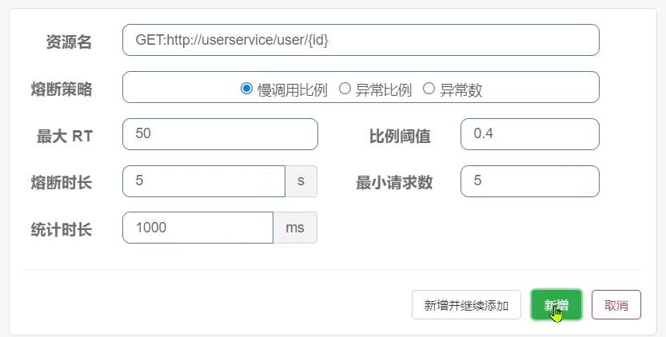

超过50ms的请求都会被认为是慢请求


#### 3）测试

在浏览器访问：http://localhost:8088/order/101，快速刷新5次，可以发现：


触发了熔断，请求时长缩短至5ms，快速失败了，并且走降级逻辑，返回的null


在浏览器访问：http://localhost:8088/order/102，竟然也被熔断了：


### 3.3.2.异常比例、异常数

**异常比例或异常数**：统计指定时间内的调用，如果调用次数超过指定请求数，并且出现异常的比例达到设定的比例阈值（或超过指定异常数），则触发熔断。

例如，一个异常比例设置：


解读：统计最近1000ms内的请求，如果请求量超过10次，并且异常比例不低于0.4，则触发熔断。

一个异常数设置：


解读：统计最近1000ms内的请求，如果请求量超过10次，并且异常比例不低于2次，则触发熔断。


**案例**

需求：给 UserClient的查询用户接口设置降级规则，统计时间为1秒，最小请求数量为5，失败阈值比例为0.4，熔断时长为5s


#### 1）设置异常请求

首先，修改user-service中的/user/{id}这个接口的业务。手动抛出异常，以触发异常比例的熔断：


也就是说，id 为 2时，就会触发异常


#### 2）设置熔断规则

下面，给feign接口设置降级规则：


规则：


在5次请求中，只要异常比例超过0.4，也就是有2次以上的异常，就会触发熔断。


####  3）测试

在浏览器快速访问：http://localhost:8088/order/102，快速刷新5次，触发熔断：


此时，我们去访问本来应该正常的103：

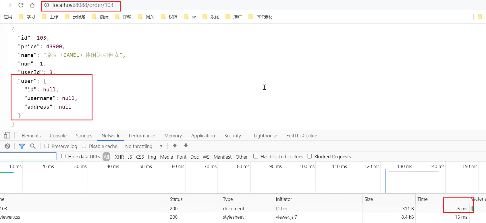


# 4.授权规则

授权规则可以对请求方来源做判断和控制。

## 4.1.授权规则

### 4.1.1.基本规则

授权规则可以对调用方的来源做控制，有白名单和黑名单两种方式。

- 白名单：来源（origin）在白名单内的调用者允许访问

- 黑名单：来源（origin）在黑名单内的调用者不允许访问

点击左侧菜单的授权，可以看到授权规则：


- 资源名：就是受保护的资源，例如/order/{orderId}

- 流控应用：是来源者的名单，
  - 如果是勾选白名单，则名单中的来源被许可访问。
  - 如果是勾选黑名单，则名单中的来源被禁止访问。

比如：


我们允许请求从gateway到order-service，不允许浏览器访问order-service，那么白名单中就要填写**网关的来源名称（origin）**。

### 4.1.2.如何获取origin

Sentinel是通过RequestOriginParser这个接口的parseOrigin来获取请求的来源的。

```java
public interface RequestOriginParser {
    /**
     * 从请求request对象中获取origin，获取方式自定义
     */
    String parseOrigin(HttpServletRequest request);
}
```

这个方法的作用就是从request对象中，获取请求者的origin值并返回。

默认情况下，sentinel不管请求者从哪里来，返回值永远是default，也就是说一切请求的来源都被认为是一样的值default。


因此，我们需要自定义这个接口的实现，让**不同的请求，返回不同的origin**。


例如order-service服务中，我们定义一个RequestOriginParser的实现类：

```java
package cn.itcast.order.sentinel;

import com.alibaba.csp.sentinel.adapter.spring.webmvc.callback.RequestOriginParser;
import org.springframework.stereotype.Component;
import org.springframework.util.StringUtils;

import javax.servlet.http.HttpServletRequest;

@Component
public class HeaderOriginParser implements RequestOriginParser {
    @Override
    public String parseOrigin(HttpServletRequest request) {
        // 1.获取请求头
        String origin = request.getHeader("origin");
        // 2.非空判断
        if (StringUtils.isEmpty(origin)) {
            origin = "blank";
        }
        return origin;
    }
}
```

我们会尝试从request-header中获取origin值。


### 4.1.3.给网关添加请求头

既然获取请求origin的方式是从reques-header中获取origin值，我们必须让**所有从gateway路由到微服务的请求都带上origin头**。

这个需要利用之前学习的一个GatewayFilter来实现，AddRequestHeaderGatewayFilter。

修改gateway服务中的application.yml，添加一个defaultFilter：

```yaml
spring:
  cloud:
    gateway:
      default-filters:
        - AddRequestHeader=origin,gateway
      routes:
       # ...略
```

这样，从gateway路由的所有请求都会带上origin头，值为gateway。而从其它地方到达微服务的请求则没有这个头。


### 4.1.4.配置授权规则

接下来，我们添加一个授权规则，放行origin值为gateway的请求。


配置如下：


现在，我们直接跳过网关，访问order-service服务：


通过网关访问：


## 4.2.自定义异常结果

默认情况下，发生限流、降级、授权拦截时，都会抛出异常到调用方。异常结果都是flow limmiting（限流）。这样不够友好，无法得知是限流还是降级还是授权拦截。


### 4.2.1.异常类型


而如果要自定义异常时的返回结果，需要实现BlockExceptionHandler接口：

```java
public interface BlockExceptionHandler {
    /**
     * 处理请求被限流、降级、授权拦截时抛出的异常：BlockException
     */
    void handle(HttpServletRequest request, HttpServletResponse response, BlockException e) throws Exception;
}
```

这个方法有三个参数：

- HttpServletRequest request：request对象
- HttpServletResponse response：response对象
- BlockException e：被sentinel拦截时抛出的异常

这里的BlockException包含多个不同的子类：

| **异常**             | **说明**           |
| -------------------- | ------------------ |
| FlowException        | 限流异常           |
| ParamFlowException   | 热点参数限流的异常 |
| DegradeException     | 降级异常           |
| AuthorityException   | 授权规则异常       |
| SystemBlockException | 系统规则异常       |


### 4.2.2.自定义异常处理

下面，我们就在order-service定义一个自定义异常处理类：

```java
package cn.itcast.order.sentinel;

import com.alibaba.csp.sentinel.adapter.spring.webmvc.callback.BlockExceptionHandler;
import com.alibaba.csp.sentinel.slots.block.BlockException;
import com.alibaba.csp.sentinel.slots.block.authority.AuthorityException;
import com.alibaba.csp.sentinel.slots.block.degrade.DegradeException;
import com.alibaba.csp.sentinel.slots.block.flow.FlowException;
import com.alibaba.csp.sentinel.slots.block.flow.param.ParamFlowException;
import org.springframework.stereotype.Component;

import javax.servlet.http.HttpServletRequest;
import javax.servlet.http.HttpServletResponse;

@Component
public class SentinelExceptionHandler implements BlockExceptionHandler {
    @Override
    public void handle(HttpServletRequest request, HttpServletResponse response, BlockException e) throws Exception {
        String msg = "未知异常";
        int status = 429;

        if (e instanceof FlowException) {
            msg = "请求被限流了";
        } else if (e instanceof ParamFlowException) {
            msg = "请求被热点参数限流";
        } else if (e instanceof DegradeException) {
            msg = "请求被降级了";
        } else if (e instanceof AuthorityException) {
            msg = "没有权限访问";
            status = 401;
        }

        response.setContentType("application/json;charset=utf-8");
        response.setStatus(status);
        response.getWriter().println("{\"msg\": " + msg + ", \"status\": " + status + "}");
    }
}
```


重启测试，在不同场景下，会返回不同的异常消息.

限流：


授权拦截时：


# 5.规则持久化

现在，sentinel的所有规则都是内存存储，重启后所有规则都会丢失。在生产环境下，我们必须确保这些规则的持久化，避免丢失。

## 5.1.规则管理模式

规则是否能持久化，取决于规则管理模式，sentinel支持三种规则管理模式：

- 原始模式：Sentinel的默认模式，将规则保存在内存，重启服务会丢失。
- pull模式
- push模式


### 5.1.1.pull模式

pull模式：控制台将配置的规则推送到Sentinel客户端，而客户端会将配置规则保存在本地文件或数据库中。以后会定时去本地文件或数据库中查询，更新本地规则。


### 5.1.2.push模式

push模式：控制台将配置规则推送到远程配置中心，例如Nacos。Sentinel客户端监听Nacos，获取配置变更的推送消息，完成本地配置更新。


## 5.2.实现push模式

详细步骤可以参考课前资料的《sentinel规则持久化》：

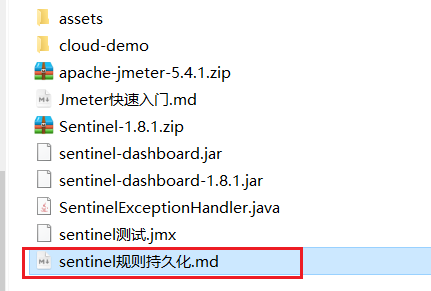
